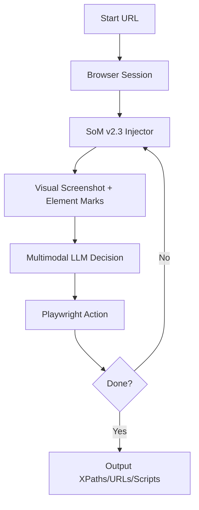

# AutoSpider - 纯视觉 SoM 浏览器 Agent

基于 LangGraph + Playwright + 多模态 LLM 的纯视觉浏览器自动化 Agent。通过模拟人类视觉识别和操作习惯，AutoSpider 能够像真人一样理解网页、进行筛选引导，并最终自动生成稳健的爬虫脚本。

## 🚀 核心特性

- **Set-of-Mark (SoM)** ⭐：
    - **智能祖先检测**：自动识别可点击的父级容器，避免标注琐碎的子元素，操作更精准。
    - **多维度可见性校验**：结合视口检测、Z-index 遮挡分析及多点采样验证，确保只标注真人可见的元素。
    - **稳健 XPath 候选**：内置启发式算法，按优先级生成最稳定的定位器（ID > TestID > Aria-Label > Text > Relative Path）。
- **全自动详情页 URL 收集** ⭐：
    - **导航引导**：LLM 根据自然语言指令，自动在列表页进行复杂的点击筛选（如选择行业、结果状态等）。
    - **模式探索**：自动进入多个详情页，学习并提取详情链接及分页控件的公共 XPath 模式。
    - **海量批量收集**：脱离 LLM，利用提取的模式进行高性能翻页收集，支持自动翻页。
- **爬虫脚本自动生成**：
    - **一键生成 Spider**：基于收集阶段沉淀的 XPaths 和 URL 列表，自动生成可独立运行的 Playwright 爬虫脚本。
    - **零模版依赖**：生成的脚本直接对接 `urls.txt`，极大提高了在大规模爬取时的可靠性和成功率。
- **反反爬机制**：
    - **随机动作延迟**：模拟人类操作间隔，支持基础延迟 + 随机抖动配置。
    - **加载策略优化**：智能等待页面加载状态及 SPA 路由更新。
- **LangGraph 驱动**：observe (SoM) → decide (LLM) → act (Playwright) → check_done 闭环流程。

## 🛠️ 安装

```bash
# 创建并激活 conda 环境
conda create -n autospider python=3.10 -y
conda activate autospider

# 以开发模式安装包
pip install -e .

# 安装 Playwright 浏览器
playwright install chromium
```

## ⚙️ 配置

### 1. 环境变量 (.env)

复制 `.env.example` 为 `.env` 并根据实际使用的 LLM 提供商填写：

```bash
cp .env.example .env
```

**关键配置项：**
- `AIPING_API_KEY`: 多模态 LLM 的 API Key。
- `AIPING_API_BASE`: API 基础路径（默认为 SiliconFlow）。
- `AIPING_MODEL`: 使用的多模态模型（推荐 `zai-org/GLM-4.6V` 或其他支持视觉的模型）。

### 2. 爬取间隔与行为配置

为了模拟人类行为并规避反爬，建议在 `.env` 中调整以下参数：

```env
# 基础操作延迟（秒）
ACTION_DELAY_BASE=1.0
# 延迟随机波动范围（秒）
ACTION_DELAY_RANDOM=0.5
# 页面加载等待时长（秒）
PAGE_LOAD_DELAY=1.5
# 滚动延迟
SCROLL_DELAY=0.5
```

> [!TIP]
> 系统的所有内部默认值均在 `src/autospider/config.py` 中集中管理，遵循 Pydantic 定义。

## 📖 使用指南

### 1. 交互式任务运行 (`run`)

执行特定的一步或多步任务。

```bash
autospider run \
  --start-url "https://example.com" \
  --task "点击登录按钮，输入 xxx，并检查登录状态" \
  --target-text "欢迎登录"
```

### 2. 详情页 URL 批量收集 (`collect-urls`) ⭐

这是本项目的旗舰功能，分为四个阶段：**筛选导航 -> 详情探索 -> 模式提取 -> 批量翻页收集**。

```bash
autospider collect-urls \
  --list-url "https://xxx.gov.cn/list" \
  --task "收集所有关于交通建设的招标公告详情页" \
  --explore-count 3
```

#### 工作流说明：
1. **引导阶段**：LLM 观察页面，自动点击筛选条件（如“进行中”、“交通运输”）。
2. **探索阶段**：LLM 尝试点击并进入 N 个详情页，记录点击路径。
3. **沉淀阶段**：系统分析记录，提取稳定且通用的详情页 XPath 及分页按钮 XPath。
4. **收集阶段**：系统利用提取的 XPath 高速遍历列表并自动翻页，将所有 URL 保存到 `output/urls.txt`。
5. **生成阶段**：自动生成 `output/spider.py`，用于后续内容的深度采集。

## 📁 输出产物

| 文件 | 说明 |
|------|------|
| `output/urls.txt` | 批量收集到的详情页 URL 纯文本列表 |
| `output/spider.py` | **自动生成的爬虫脚本**，直接读取 urls.txt 进行内容爬取 |
| `output/collection_config.json` | 沉淀下来的导航步骤、详情 XPath 和分页 XPath |
| `output/collected_urls.json` | 包含探索过程及完整 URL 列表的元数据文件 |
| `output/screenshots/` | 整个过程中每一步的 SoM 视觉标注截图序列 |

## 🏗️ 架构概览



## 📜 许可证

MIT
