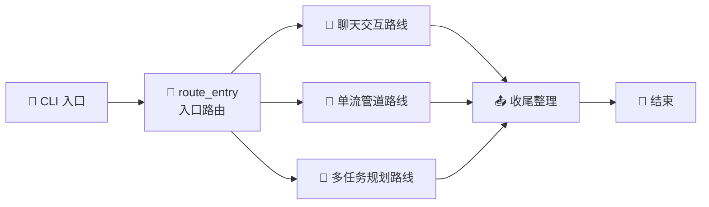

<a href="https://deepwiki.com/pinkllo/autospider"></a>

# AutoSpider

**[English](README_en.md)** | 中文

AutoSpider 是一个基于 `LangGraph + Playwright + SoM(Set-of-Mark)` 的纯视觉网页采集 Agent。
它可以自动完成列表页探索、详情页 URL 收集、字段规则归纳（XPath）以及批量抽取，并通过独创的"智能规划引擎"实现大型复杂站点的全自动全站爬取。

## 🌟 核心能力

- **全自然语言对话交互 (`chat-pipeline`)**：只需输入一句话，系统会通过多轮 AI 澄清对话 (`TaskClarifier`) 自动对齐需求、推断目标及提取字段配置，随后一键启动完整的数据采集流水线。
- **智能规划引擎 (Planning Agent)**：面对多分类/多频道的复杂站点，内置 `TaskPlanner` 能够利用 SoM 视觉大模型技术，自主分析页面导航结构，将大型爬取任务自动拆解为多个独立稳定的子任务，彻底攻克规模化采集难题。
- **强健稳定的全自动 XPath 归纳**：不仅自主学习全站导航步骤，还运用多种策略（深度绑定 `id`, `class`, `data-*` 等语义属性）归纳并优选最稳定的多重属性 XPath。并内置"内省与自适应挽救机制（Salvage Mechanism）"，自动修正极少数提取异常的字段。
- **自适应网络拦截与人工接管 (Guard)**：全新的网络与行为监控机制，遇到需要登录、人机验证等情况会自动弹出系统横幅，实时等待用户接管处理，并自动持久化 Cookie 与会话状态（`.auth/`）。
- **Redis-only 运行契约**：当前对外 CLI 与流水线契约已收口为 Redis-only。图编排、并发流水线、断点续爬和动态速率控制仍保留，但日常开发入口统一为 `doctor`、`chat-pipeline`、`resume`、`db-init`。

## 🏗️ 系统架构

AutoSpider 采用基于 LangGraph 的状态图架构，通过统一入口节点进入 `chat-pipeline` 主链路。当前开发者入口收口为：先运行 `doctor` 做环境自检，再使用 `chat-pipeline` 执行主链路；`resume` 与 `db-init` 仅作为运维命令保留。在当前实现中，chat 发起的任务会固定先进入 planning，再进入 multi-dispatch：


```mermaid
graph LR
  A["🚀 CLI 入口"] --> B["🔀 route_entry<br/>入口路由"]
  B --> C["💬 聊天交互路线"]
  B --> D["🔧 单流管道路线"]
  B --> F["🧠 多任务规划路线"]

  C --> G["📤 收尾整理"]
  D --> G
  F --> G
  G --> H["🔴 结束"]
```

> 📊 完整的带功能描述的节点级流程图请参见 [`main_graph.mmd`](main_graph.mmd)

### 分支路线说明

| 入口模式          | 执行路线                                                                 | 功能说明                                  |
| :---------------- | :----------------------------------------------------------------------- | :---------------------------------------- |
| `chat_pipeline` | chat_clarify → chat_history_match → chat_review_task → chat_prepare_execution_handoff → plan_node → multi_dispatch_subgraph → aggregate_node | 💬 正式主链路：自然语言澄清后进入 planning-first 并发执行 |

> `collect_urls`、`generate_config`、`batch_collect`、`field_extract`、`multi_pipeline` 等旧内部能力节点不再作为正式入口维护；如需保留，仅视为迁移期内部实现细节。

## ⚙️ 运行要求

- Python `>=3.10`
- 已安装浏览器驱动（Playwright Chromium）

## 📦 安装

```bash
pip install -e .
playwright install chromium
```

可选依赖：

```bash
pip install -e ".[redis]"   # Redis 队列能力
pip install -e ".[db]"      # 数据库相关能力
pip install -e ".[spider]"  # Scrapy 相关能力
pip install -e ".[dev]"     # 测试/格式化/类型检查
```

## 🛠 配置（`.env`）

先复制 `.env.example` 为 `.env`，再按需修改。
最小可用配置示例（按代码实际读取的变量名）：

```env
BAILIAN_API_KEY=your_api_key
BAILIAN_API_BASE=https://api.siliconflow.cn/v1
BAILIAN_MODEL=qwen3.5-plus

# 规划器专用模型（如需单独指定更强大的视觉模型）
# PLANNER_API_KEY=your_planner_key
# PLANNER_MODEL=qwen-vl-plus

REDIS_ENABLED=true
REDIS_HOST=127.0.0.1
REDIS_PORT=6379
HEADLESS=false
PIPELINE_MODE=redis
```

*注意：当前公开 CLI 只支持 Redis-only 运行契约；`doctor` 会优先检查数据库、Redis 和 graph checkpoint 配置。*

## 🚀 快速开始

### 0) 先做环境自检

```bash
autospider doctor
```

### 1) 全自然语言多轮交互执行（最推荐 🎉）

无需手写繁琐配置或分析结构。系统会先澄清任务、按需复用历史任务、执行 review，再进入 planning 与并发子任务调度：

```bash
# 自动澄清需求，并进入 planning-first 的 chat 主链路
autospider chat-pipeline -r "帮我采集 example 网站所有分类的公告列表，字段包含标题和发布时间"
```

### 2) 恢复中断执行

```bash
autospider resume --thread-id "<thread_id>"
```

## 📂 核心项目结构

```text
src/autospider/
├── cli.py                     # 命令行入口 (doctor / chat-pipeline / resume / db-init)
├── cli_runtime.py             # CLI 运行时装配与 doctor 自检 helper
├── graph/                     # LangGraph 状态图编排层（主图/恢复/汇总适配）
│   ├── main_graph.py          #   主图构建与路由逻辑
│   ├── runner.py              #   GraphRunner 统一执行入口
│   ├── state.py               #   GraphState 状态定义
│   ├── types.py               #   入口模式/状态枚举
│   └── nodes/                 #   图节点实现
│       ├── entry_nodes.py     #     入口路由 / 参数归一化 / 对话澄清
│       ├── capability_nodes.py#     各能力执行节点
│       └── shared_nodes.py    #     共享收尾节点 (Artifact/Summary/Finalize)
├── common/                    # 过渡期通用基础设施（后续逐步拆分，不再新增业务模块）
│   ├── config.py              #   全局配置管理
│   ├── browser/               #   BrowserRuntimeSession 主生命周期抽象（BrowserSession 兼容层）
│   ├── channel/               #   Redis-only 消息队列与运行时适配
│   ├── llm/                   #   LLM 对话澄清 (TaskClarifier) 与决策器
│   ├── som/                   #   Set-of-Mark 视觉标注引擎
│   ├── storage/               #   持久化存储与 Redis 管理
│   └── utils/                 #   工具函数 (模糊搜索 / 延迟 / 模板)
├── crawler/                   # 采集引擎
│   ├── base/                  #   基础采集器 (BaseCollector)
│   ├── collector/             #   URL 收集与配置生成器
│   ├── explore/               #   探索引擎 (配置生成 / URL 收集)
│   ├── batch/                 #   批量采集器
│   ├── planner/               #   TaskPlanner 智能任务规划引擎
│   └── checkpoint/            #   断点续爬与速率控制
├── field/                     # 字段工厂
│   ├── field_extractor.py     #   字段提取器核心逻辑
│   ├── xpath_pattern.py       #   多策略 XPath 归纳引擎
│   ├── field_decider.py       #   字段决策与挽救机制
│   ├── batch_field_extractor.py#  批量字段提取
│   └── batch_xpath_extractor.py#  批量 XPath 提取
├── pipeline/                  # 单子任务执行流水线
│   ├── aggregator.py          #   ResultAggregator 结果聚合器
│   ├── worker.py              #   SubTaskWorker 子任务执行单元
│   └── runner.py              #   Pipeline 生产者-消费者运行器
├── output/                    # 输出处理
└── prompts/                   # AI Prompt 模板与提示词工程
    ├── task_clarifier.yaml    #   对话澄清提示词
    ├── planner.yaml           #   任务规划提示词
    ├── url_collector.yaml     #   URL 收集提示词
    ├── field_extractor.yaml   #   字段提取提示词
    ├── xpath_pattern.yaml     #   XPath 归纳提示词
    └── decider.yaml           #   字段决策提示词
```

> 当前约束：
> 对外开发入口已收口为 `autospider doctor`、`chat-pipeline`、`resume`、`db-init`；
> 历史兼容入口 `BrowserSession`、`TaskRegistry`、`FieldXPathRegistry` 与旧 service facade 已移除。

## 🧪 开发与测试

```bash
pip install -e ".[redis,db,dev]"
autospider doctor
pytest -m smoke -q
pytest tests/e2e -m e2e -q
```

其中 `pytest tests/e2e -m e2e -q` 是当前唯一维护的 E2E 入口；运行依赖或基础设施不可用时，会以显式 `skip` 收口，而不是在 `pytest configure` 阶段硬失败。更完整的闭环说明见 [`tests/e2e/README.md`](tests/e2e/README.md)。

## 📄 License

MIT License
