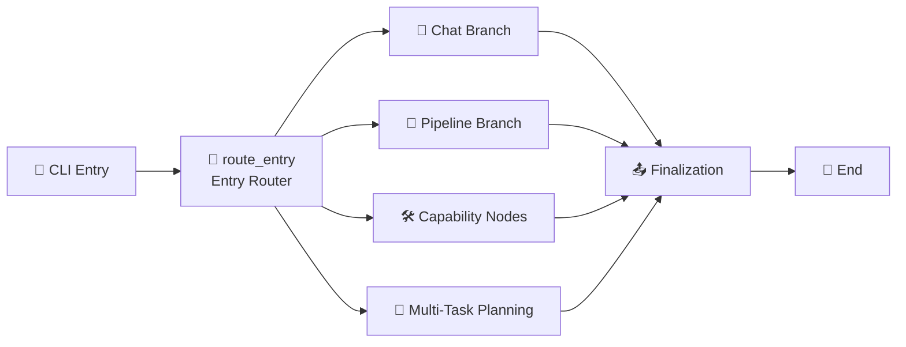

<a href="https://deepwiki.com/pinkllo/autospider"></a>

# AutoSpider

English | **[中文](README.md)**

AutoSpider is a pure-vision web crawling agent built with `LangGraph + Playwright + SoM (Set-of-Mark)`.
It can automatically discover detail links, infer highly stable and reusable XPath patterns, extract structured fields, and utilize a **Planning Agent** to decompose and crawl large-scale, complex multi-category websites.

## 🌟 Key Features

- **Natural Language Interaction (`chat-pipeline`)**: Define what you want in plain text. A multi-turn AI clarification system (`TaskClarifier`) automatically infers the target URL, data fields, and optimal crawling strategy, then launches the full pipeline with a single command.
- **Smart Planning Agent**: Employs SoM visual recognition to analyze complex site navigation. It automatically breaks down massive, multi-category websites into independent, stable sub-tasks (`multi` mode) for scalable crawling.
- **Robust XPath Generation & Error Salvage**: Infers comprehensive multi-attribute XPath selectors (binding `id`, `class`, `data-*`). A built-in "salvage mechanism" automatically fixes and repairs field extraction errors gracefully on the fly.
- **Non-intrusive Guard & Session Memory**: When captchas or logins interrupt, the crawler pauses seamlessly, popping a unified browser banner for human intervention. Session status is saved incrementally inside `.auth/`.
- **Flexible execution backend**: the underlying Graph still provides unified orchestration, concurrent pipelines, resumability, adaptive rate control, and `memory` / `file` / `redis` channels, while the public CLI is intentionally reduced to a smaller set of main commands.

## 🏗️ System Architecture

AutoSpider uses a LangGraph-based state graph architecture, routing through a unified entry node based on `entry_mode`. The public CLI now keeps only 3 main commands, while the graph still supports multiple internal execution modes:



> 📊 For a detailed node-level flowchart with feature descriptions, see [`output/graph/main_graph.mmd`](main_graph.mmd)

### Execution Routes

| Entry Mode | Execution Route | Description |
|:---|:---|:---|
| `chat_pipeline` | chat_clarify → chat_route_execution → execute_single_or_multi | 💬 AI-driven multi-turn dialog then auto-execute |
| `pipeline_run` | normalize_pipeline_params → run_pipeline_node | 🔧 Internal single-flow pipeline |
| `collect_urls` | collect_urls_node | 🔗 Internal URL collection |
| `generate_config` | generate_config_node | ⚙️ Internal config generation |
| `batch_collect` | batch_collect_node | 📦 Internal batch collection |
| `field_extract` | field_extract_node | 🔍 Internal field extraction |
| `multi_pipeline` | plan_node → multi_dispatch_subgraph → aggregate_node | 🧠 Smart planning + concurrent dispatch + result aggregation |

## ⚙️ Requirements

- Python `>=3.10`
- Playwright Chromium

## 📦 Installation

```bash
pip install -e .
playwright install chromium
```

Optional extras:
```bash
pip install -e ".[redis]"   # Redis queue support
pip install -e ".[db]"      # Database support
pip install -e ".[spider]"  # Scrapy integration
pip install -e ".[dev]"     # Testing / formatting / type checking
```

## 🛠 Configuration (`.env`)

Copy `.env.example` to `.env` and set values.
Minimal working setup:

```env
BAILIAN_API_KEY=your_api_key
BAILIAN_API_BASE=https://api.siliconflow.cn/v1
BAILIAN_MODEL=qwen3.5-plus

# Dedicated Vision-Model Planner (Optional)
# PLANNER_API_KEY=your_planner_key
# PLANNER_MODEL=qwen-vl-plus

HEADLESS=false
PIPELINE_MODE=memory
```

*Note: if `--mode` is not passed to `chat-pipeline`, the default comes from `PIPELINE_MODE`. Use `memory` when Redis is not configured.*

## 🚀 Quick Start

### 0) AI-Driven Interactive Crawling (Recommended 🎉)

Chat your way to data. The system automatically reasons and coordinates tasks via single or multi-channel strategies:

```bash
# Automatically clarifies the task and picks the right execution path
autospider chat-pipeline -r "Collect articles across all categories from example.com and extract titles & dates"
```

### 1) Multi-category parallel collection

```bash
autospider multi-pipeline \
  --site-url "https://example.com" \
  --request "Collect announcement data across all categories" \
  --fields-file fields.json \
  --output output
```

### 2) Resume an interrupted run

```bash
autospider resume --thread-id "<thread_id>"
```

## 📂 Core Project Structure

```text
src/autospider/
├── cli.py                     # CLI entry point (chat-pipeline / multi-pipeline / resume)
├── graph/                     # LangGraph state graph orchestration layer
│   ├── main_graph.py          #   Main graph construction & routing logic
│   ├── runner.py              #   GraphRunner unified execution entry
│   ├── state.py               #   GraphState state definition
│   ├── types.py               #   Entry mode / status enums
│   └── nodes/                 #   Graph node implementations
│       ├── entry_nodes.py     #     Entry routing / param normalization / dialog clarification
│       ├── capability_nodes.py#     Capability execution nodes
│       └── shared_nodes.py    #     Shared finalization nodes (Artifact/Summary/Finalize)
├── common/                    # Shared infrastructure
│   ├── config.py              #   Global configuration management
│   ├── browser/               #   BrowserSession management
│   ├── channel/               #   Message queues (memory / file / redis)
│   ├── llm/                   #   LLM dialog clarification (TaskClarifier) & decision engine
│   ├── som/                   #   Set-of-Mark visual annotation engine
│   ├── storage/               #   Persistence & Redis management
│   └── utils/                 #   Utilities (fuzzy search / delay / templates)
├── crawler/                   # Crawling engine
│   ├── base/                  #   Base collector (BaseCollector)
│   ├── collector/             #   URL collector & config generator
│   ├── explore/               #   Exploration engine (config gen / URL collection)
│   ├── batch/                 #   Batch collector
│   ├── planner/               #   TaskPlanner smart planning engine
│   └── checkpoint/            #   Breakpoint resumption & rate control
├── field/                     # Field extraction factory
│   ├── field_extractor.py     #   Core field extraction logic
│   ├── xpath_pattern.py       #   Multi-strategy XPath inference engine
│   ├── field_decider.py       #   Field decision & salvage mechanism
│   ├── batch_field_extractor.py#  Batch field extraction
│   └── batch_xpath_extractor.py#  Batch XPath extraction
├── pipeline/                  # Pipeline execution
│   ├── aggregator.py          #   ResultAggregator result merger
│   ├── worker.py              #   SubTaskWorker isolated subtask worker
│   └── runner.py              #   Pipeline producer-consumer runner
├── output/                    # Output processing
└── prompts/                   # AI Prompt engineering templates
    ├── task_clarifier.yaml    #   Dialog clarification prompts
    ├── planner.yaml           #   Task planning prompts
    ├── url_collector.yaml     #   URL collection prompts
    ├── field_extractor.yaml   #   Field extraction prompts
    ├── xpath_pattern.yaml     #   XPath inference prompts
    └── decider.yaml           #   Field decision prompts
```

## 🧪 Development & Testing

```bash
pip install -e ".[dev]"
pytest
```

## 📄 License

MIT License
