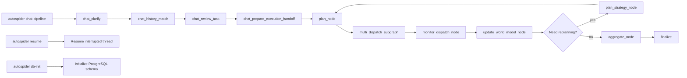

<a href="https://deepwiki.com/pinkllo/autospider"></a>

# AutoSpider

English | **[中文](README.md)**

AutoSpider is a pure-vision web crawling agent built with `LangGraph + Playwright + SoM (Set-of-Mark)`.
Its public workflow is now centered on a planning-first chat pipeline that connects clarification, history reuse, grouped planning, concurrent subtask execution, and resumable aggregation.

## 🌟 Key Features

- **Planning-first chat pipeline (`chat-pipeline`)**: Describe the job in plain text, then let the system clarify requirements, match relevant history, request a final review, and only then hand off into planning and multi-dispatch.
- **Explicit grouped collection semantics**: When the clarified task becomes `group_by=category`, the runtime treats categories discovered from the page as first-class groups, and `per_group_target_count` means "how many records per discovered category."
- **Category facts come from page analysis and subtask scope**: category discovery is driven by page facts gathered during planning; once dispatched, category values are emitted from each subtask's `scope` / `fixed_fields` rather than guessed again from detail pages.
- **Robust XPath Generation & Error Salvage**: Infers comprehensive multi-attribute XPath selectors (binding `id`, `class`, `data-*`). A built-in "salvage mechanism" automatically fixes and repairs field extraction errors gracefully on the fly.
- **Non-intrusive Guard & Session Memory**: When captchas or logins interrupt, the crawler pauses seamlessly, popping a unified browser banner for human intervention. Session status is saved incrementally inside `.auth/`.
- **Semantic identity for history reuse**: task reuse is aligned by a normalized `semantic_signature` built from grouped strategy payloads plus field names, instead of relying on URL matching alone.

## 🏗️ System Architecture

AutoSpider uses a LangGraph-based state graph architecture. The public CLI currently exposes only 3 commands: `chat-pipeline`, `resume`, and `db-init`. The only user-facing crawl entry is `chat-pipeline`, and chat-originated work always enters planning before dispatch monitoring, world-model feedback, and final aggregation:



> 📊 For a detailed node-level flowchart with feature descriptions, see [`output/graph/main_graph.mmd`](main_graph.mmd)

### Execution Routes

| Entry Mode | Execution Route | Description |
|:---|:---|:---|
| `chat_pipeline` | chat_clarify → chat_history_match → chat_review_task → chat_prepare_execution_handoff → plan_node → multi_dispatch_subgraph → monitor_dispatch_node → update_world_model_node → (optional replanning) → aggregate_node | 💬 AI-driven multi-turn dialog, then planning-first execution with feedback-driven replanning |

> Legacy capabilities such as `collect_urls`, `generate_config`, `batch_collect`, `field_extract`, and `multi_pipeline` may still exist internally, but they are no longer documented as public README entry points.

## ⚙️ Requirements

- Python `>=3.10`
- Playwright Chromium

## 📦 Installation

```bash
pip install -e .
playwright install chromium
```

Optional extras:
```bash
pip install -e ".[redis]"   # Redis queue support
pip install -e ".[db]"      # Database support
pip install -e ".[spider]"  # Scrapy integration
pip install -e ".[dev]"     # Testing / formatting / type checking
```

## 🛠 Configuration (`.env`)

Copy `.env.example` to `.env` and set values.
Minimal working setup:

```env
BAILIAN_API_KEY=your_api_key
BAILIAN_API_BASE=https://api.siliconflow.cn/v1
BAILIAN_MODEL=qwen3.5-plus

# Dedicated Vision-Model Planner (Optional)
# SILICON_PLANNER_API_KEY=your_planner_key
# SILICON_PLANNER_MODEL=qwen-vl-plus

HEADLESS=false
PIPELINE_MODE=memory
```

*Note: if `--mode` is not passed to `chat-pipeline`, the default comes from `PIPELINE_MODE`. The current code accepts backend values `memory`, `file`, and `redis`. Switch to `redis` only after installing and configuring the Redis-related dependencies.*

## 🚀 Quick Start

### 0) AI-Driven Interactive Crawling (Recommended 🎉)

Chat your way to data. The system clarifies the task, optionally reuses historical tasks, asks for final review, then enters planning and concurrent subtask dispatch automatically:

```bash
# Automatically clarifies the task and enters the planning-first chat pipeline
autospider chat-pipeline -r "Collect 3 majors per category from all categories discovered on example.com, including title and category name"
```

### Grouped collection semantics

- `group_by=category`: dispatches one subtask per category discovered from the page, instead of guessing category labels from detail pages later.
- `per_group_target_count`: the target count for each discovered category, not a single global cap shared across all categories.
- `category_discovery_mode=auto`: categories come from page facts unless the user explicitly constrains them with `requested_categories`.
- Category fields in emitted records come from subtask `scope` / `fixed_fields`, which makes category output deterministic even when detail pages omit or vary category text.

### 1) Resume an interrupted run

```bash
autospider resume --thread-id "<thread_id>"
```

## 📂 Core Project Structure

```text
src/autospider/
├── cli.py                     # CLI entry point (chat-pipeline / resume / db-init)
├── graph/                     # LangGraph state graph orchestration layer
│   ├── main_graph.py          #   Main graph construction & routing logic
│   ├── runner.py              #   GraphRunner unified execution entry
│   ├── state.py               #   GraphState state definition
│   ├── types.py               #   Entry mode / status enums
│   └── nodes/                 #   Graph node implementations
│       ├── entry_nodes.py     #     Entry routing / param normalization / dialog clarification
│       ├── capability_nodes.py#     Capability execution nodes
│       └── shared_nodes.py    #     Shared finalization nodes (Artifact/Summary/Finalize)
├── common/                    # Shared infrastructure
│   ├── config.py              #   Global configuration management
│   ├── browser/               #   BrowserSession management
│   ├── channel/               #   Pipeline backend channels (memory / file / redis)
│   ├── llm/                   #   LLM dialog clarification (TaskClarifier) & decision engine
│   ├── som/                   #   Set-of-Mark visual annotation engine
│   ├── storage/               #   Persistence & Redis management
│   └── utils/                 #   Utilities (fuzzy search / delay / templates)
├── crawler/                   # Crawling engine
│   ├── base/                  #   Base collector (BaseCollector)
│   ├── collector/             #   URL collector & config generator
│   ├── explore/               #   Exploration engine (config gen / URL collection)
│   ├── batch/                 #   Batch collector
│   ├── planner/               #   TaskPlanner smart planning engine
│   └── checkpoint/            #   Breakpoint resumption & rate control
├── field/                     # Field extraction factory
│   ├── field_extractor.py     #   Core field extraction logic
│   ├── xpath_pattern.py       #   Multi-strategy XPath inference engine
│   ├── field_decider.py       #   Field decision & salvage mechanism
│   ├── batch_field_extractor.py#  Batch field extraction
│   └── batch_xpath_extractor.py#  Batch XPath extraction
├── pipeline/                  # Pipeline execution
│   ├── aggregator.py          #   ResultAggregator result merger
│   ├── worker.py              #   SubTaskWorker isolated subtask worker
│   └── runner.py              #   Pipeline producer-consumer runner
├── output/                    # Output processing
└── prompts/                   # AI Prompt engineering templates
    ├── task_clarifier.yaml    #   Dialog clarification prompts
    ├── planner.yaml           #   Task planning prompts
    ├── url_collector.yaml     #   URL collection prompts
    ├── field_extractor.yaml   #   Field extraction prompts
    ├── xpath_pattern.yaml     #   XPath inference prompts
    └── decider.yaml           #   Field decision prompts
```

## 🧪 Development & Testing

```bash
pip install -e ".[dev]"
pytest
```

## 📄 License

MIT License
