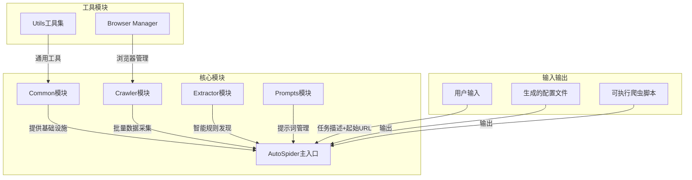
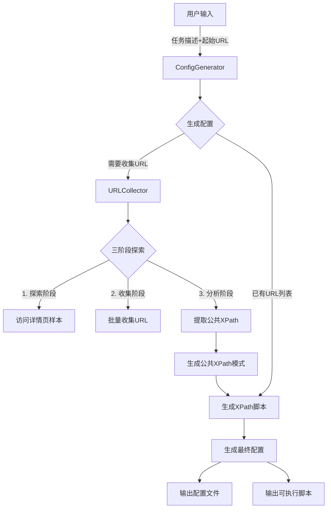
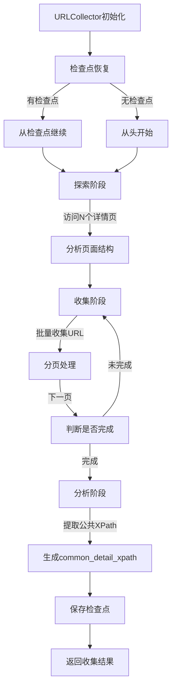
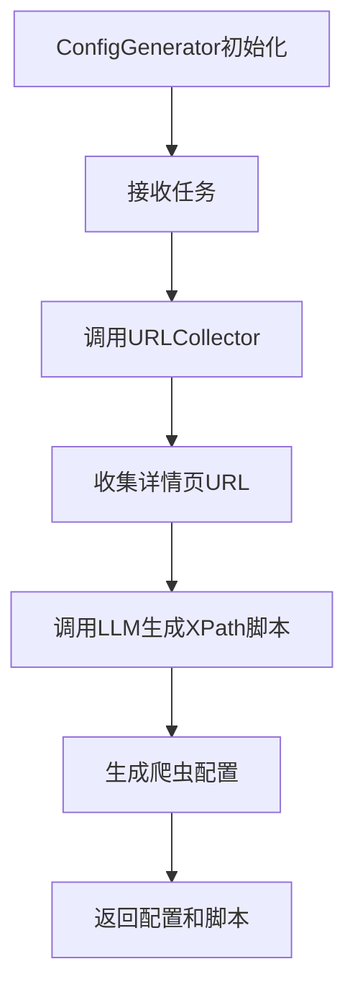
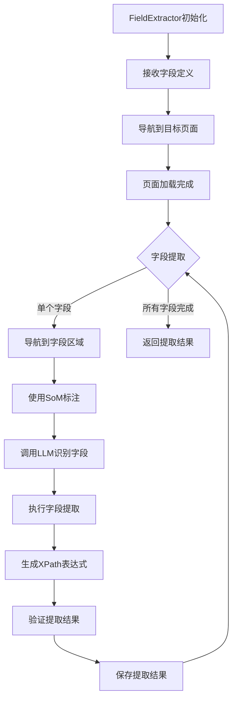
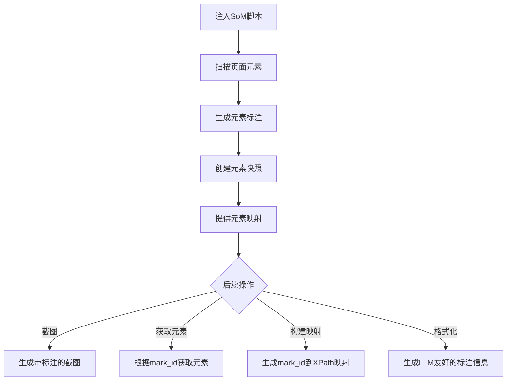
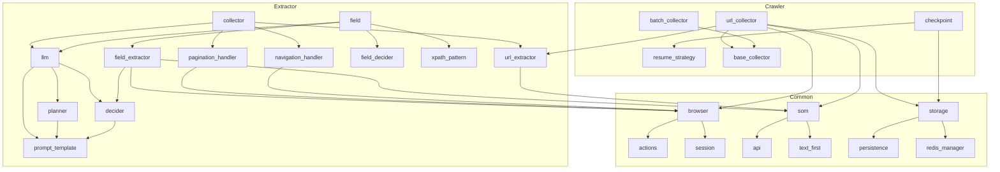
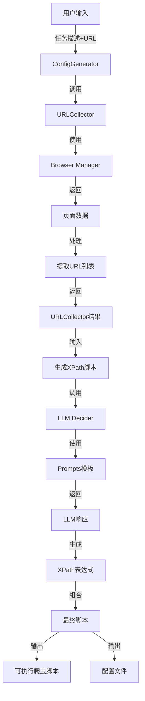
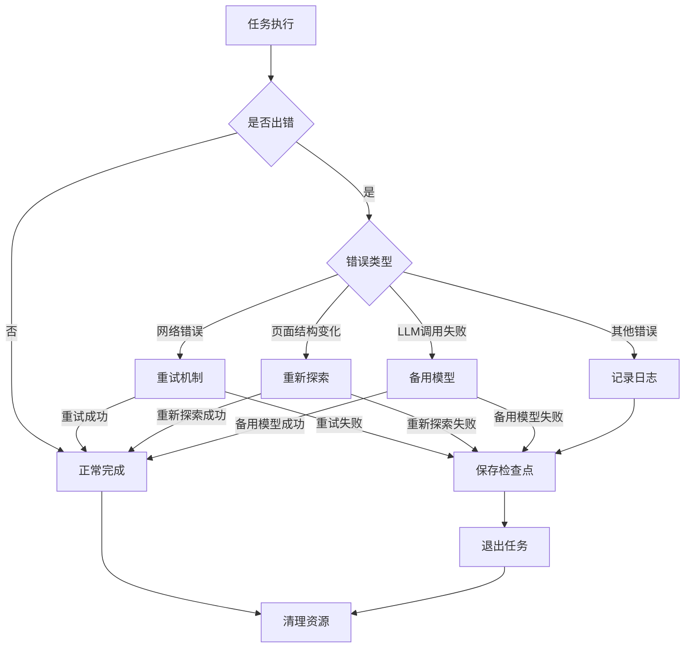
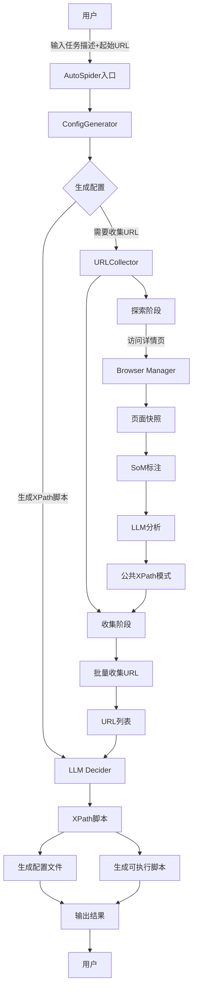

# AutoSpider 项目流程图

## 1. 整体架构

## 2. 核心工作流程

## 3. URLCollector工作流程

## 4. ConfigGenerator工作流程

## 5. Extractor Field模块工作流程

## 6. Common SOM模块工作流程

## 7. 模块间依赖关系

## 8. 数据流向图

## 9. 故障处理流程

## 10. 完整系统流程图

---

## 图例说明

- **矩形框**：表示模块、类或函数
- **菱形框**：表示判断或条件分支
- **箭头**：表示数据流向或调用关系
- **子图**：表示模块分组
- **虚线箭头**：表示间接依赖关系
- **实线箭头**：表示直接调用或数据传递

## 使用说明

1. 这些流程图使用Mermaid语法编写，可以直接在支持Mermaid的Markdown编辑器中查看
2. 建议使用VS Code配合Markdown Preview Mermaid Support插件查看
3. 也可以将Mermaid代码复制到[Mermaid Live Editor](https://mermaid.live/)中查看
4. 流程图展示了AutoSpider的核心架构、工作流程和模块间关系，有助于理解系统设计

## 设计原则

1. **模块化设计**：清晰的模块划分，便于维护和扩展
2. **分层架构**：核心模块、工具模块、输入输出层分离
3. **数据驱动**：以数据流向为主线，清晰展示系统运行逻辑
4. **可视化**：通过流程图直观展示复杂系统的工作原理
5. **完整性**：覆盖从用户输入到最终输出的完整流程

---

*最后更新: 2026-01-19*