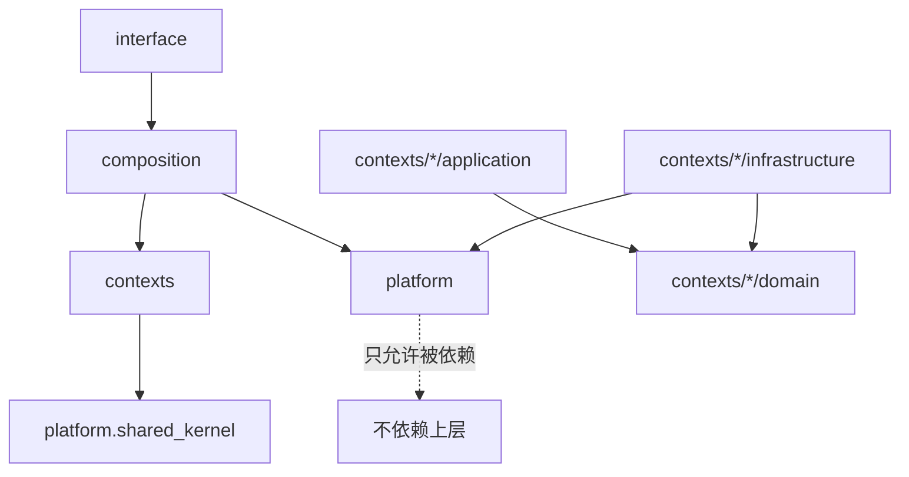

# 01 · 目标架构

AutoSpider 重构为「**轻量 DDD + 模块化单体**」：以 4 个业务 Bounded Context 组织领域逻辑，3 个支撑层提供基础能力与对外接口；Context 之间通过领域事件解耦，不得直接互相 import。

---

## 1. Bounded Context 划分

### 1.1 业务上下文（4 个）

| # | Context | 职责 | 核心聚合根 / 值对象 | 关键用例（应用服务） |
|---|---|---|---|---|
| 1 | **Planning** | 理解请求 → 生成 `TaskPlan` → 分解 `SubTask`；监听失败事件触发 replan | `TaskPlan`（根）、`SubTask`、`PlanIntent`、`FailureSignal`（VO） | `CreatePlan`、`DecomposePlan`、`Replan`、`ClassifyRuntimeException` |
| 2 | **Collection** | 执行 `SubTask`：导航、翻页、URL 提取、字段提取、最终落盘 | `CollectionRun`（根）、`PageResult`、`FieldBinding`、`XPathPattern`（VO） | `RunSubTask`、`ExtractFields`、`FinalizeRun`、`ResolveVariant` |
| 3 | **Experience** | 技能沉淀、复用、查询（跨 Run 的学习沉淀） | `Skill`（根）、`SkillUsage`、`SiteProfile`（VO） | `SedimentSkill`、`LookupSkill`、`UpdateSkillStats` |
| 4 | **Chat** | 用户意图澄清对话、任务规范化 | `ClarificationSession`（根）、`DialogueTurn` | `StartClarification`、`AdvanceDialogue`、`FinalizeTask` |

### 1.2 支撑层（3 个，非业务 Context）

| 层 | 角色 | 典型内容 |
|---|---|---|
| **Composition** | 跨上下文用例编排 | LangGraph 主图、长事务 Saga（如 `plan→collect→sediment`）、CLI 用例入口 |
| **Platform** | 技术能力适配 | `browser`（Playwright + SoM）、`llm`（OpenAI/模板）、`messaging`、`persistence`（Redis/SQL/文件）、`observability`、`config`、`shared_kernel` |
| **Interface** | 对外 I/O | `cli`（Typer 子命令）、未来可能的 HTTP/gRPC |

---

## 2. 每个 Context 的内部分层

```text
contexts/<name>/
├── domain/                  # 纯 Python + pydantic/dataclass；零第三方依赖
│   ├── model.py             # Aggregate Root + Entity + Value Object
│   ├── events.py            # Domain Events（dataclass / pydantic）
│   ├── services.py          # Domain Service：跨聚合、无状态的业务规则
│   ├── policies.py          # Policy：可替换的业务策略（如失败分类）
│   └── ports.py             # Repository / 外部服务 Protocol（抽象）
├── application/             # Application Service（用例）
│   ├── use_cases/           # 每个文件一个用例：create_plan.py 等
│   ├── dto.py               # 入参/返回 DTO（pydantic）
│   ├── handlers.py          # Event Handler（订阅本上下文感兴趣的事件）
│   └── unit_of_work.py      # 事务边界（可选）
└── infrastructure/          # 适配器：实现 domain/ports
    ├── repositories/        # SQLAlchemy / Redis 仓储实现
    ├── adapters/            # 外部系统适配（LLM、Browser 封装）
    └── publishers.py        # 把本上下文的 Domain Event 发布到 Messaging
```

### 层职责边界（硬约束）

- **`domain/`**：
  - 只依赖 Python 标准库、`pydantic`、`dataclasses`、`autospider.platform.shared_kernel`。
  - **禁止** import `langgraph`、`playwright`、`redis`、`sqlalchemy`、`openai`、`loguru`、`langchain`、`requests`。
  - Port 用 `typing.Protocol`（structural typing）或 ABC 定义，**零实现**。
- **`application/`**：
  - 可依赖 `domain/*` 与本上下文的 `domain/ports`。
  - **禁止** 直接 import `infrastructure/*`（通过依赖注入获取实现）。
  - 可依赖 `platform.shared_kernel`、`platform.observability`（日志）、`platform.messaging`（发布事件）。
- **`infrastructure/`**：
  - 实现 `domain/ports` 定义的接口。
  - 可依赖 `platform.*` 与 `domain/*`。
  - **禁止** 被 `domain/` 与 `application/` 反向 import。

---

## 3. Context 之间的通讯协议

**铁律：Bounded Context 之间不允许 `import`**（由 `import-linter` 的 `independence` 契约强制）。

### 允许的通讯方式

| 方式 | 场景 | 落地 |
|---|---|---|
| **Domain Event** | 异步解耦的单向通知（如 `PlanCreated` → Collection 订阅） | `platform.messaging` 发布到 Redis Stream；各 Context 在 `application/handlers.py` 订阅 |
| **Composition 层编排** | 需要同步协调多个 Context 的用例 | `composition/sagas/*.py` 持有各 Context 的 Application Service 入口，按状态机调度 |
| **Shared Kernel** | 极少数通用值对象（`RunId`、`TaskId`、`UtcDatetime`） | `platform.shared_kernel`，内容保持最小 |

### 不允许

- Context A 的 `domain/` / `application/` 直接 import Context B 的任何模块
- Context A 的 Repository 读写 Context B 的数据库表
- Context 共用 ORM 模型（各 Context 有自己的 ORM 实体；如需同表则通过事件复制数据或用视图）

---

## 4. Shared Kernel 最小集

`platform/shared_kernel/` 内容严格管控，增减需走 ADR：

| 模块 | 内容 |
|---|---|
| `ids.py` | `RunId`、`TaskId`、`SubTaskId`、`PlanId`、`SkillId`（`typing.NewType`） |
| `time.py` | `UtcDatetime`（alias）、`Clock` 接口（`now() -> UtcDatetime`） |
| `result.py` | `ResultEnvelope[T]`、`ErrorInfo`（见 `03-contracts.md §5`） |
| `errors.py` | `DomainError`（业务规则违反）、`InfrastructureError`（外部异常包装）基类 |
| `trace.py` | `trace_id` / `run_id` 的 `contextvars` 访问器 |

**禁止**放进 Shared Kernel：具体业务模型（Plan/SubTask/Skill 等）、基础设施客户端。

---

## 5. 目标目录树（完整形态）

```text
src/autospider/
├── __init__.py
├── __main__.py
├── contexts/
│   ├── __init__.py
│   ├── planning/
│   │   ├── __init__.py
│   │   ├── domain/
│   │   │   ├── __init__.py
│   │   │   ├── model.py            # TaskPlan, SubTask, PlanIntent
│   │   │   ├── events.py           # PlanCreated, PlanReplanned, SubTaskPlanned
│   │   │   ├── services.py         # PlanDecomposer, ReplanStrategy
│   │   │   ├── policies.py         # FailureClassifier
│   │   │   └── ports.py            # PlanRepository, LLMPlanner
│   │   ├── application/
│   │   │   ├── __init__.py
│   │   │   ├── use_cases/
│   │   │   │   ├── create_plan.py
│   │   │   │   ├── decompose_plan.py
│   │   │   │   ├── replan.py
│   │   │   │   └── classify_runtime_exception.py
│   │   │   ├── dto.py
│   │   │   └── handlers.py         # 订阅 collection.SubTaskFailed → 触发 replan
│   │   └── infrastructure/
│   │       ├── __init__.py
│   │       ├── repositories/
│   │       │   └── plan_repository.py
│   │       ├── adapters/
│   │       │   └── llm_planner.py
│   │       └── publishers.py
│   ├── collection/
│   │   ├── domain/
│   │   │   ├── model.py            # CollectionRun, PageResult
│   │   │   ├── events.py           # CollectionStarted, PageScraped, FieldExtracted, SubTaskFailed
│   │   │   ├── services.py         # PaginationStrategy, NavigationPlanner
│   │   │   ├── policies.py         # VariantResolver
│   │   │   ├── field/
│   │   │   │   ├── model.py        # FieldDefinition, FieldBinding, XPathPattern
│   │   │   │   ├── rules.py        # XPath 规则（纯）
│   │   │   │   └── matcher.py
│   │   │   └── ports.py            # BrowserSession, LLMFieldDecider, RunRepository
│   │   ├── application/
│   │   │   ├── use_cases/
│   │   │   │   ├── run_subtask.py
│   │   │   │   ├── extract_fields.py
│   │   │   │   ├── extract_fields_batch.py
│   │   │   │   └── finalize_run.py
│   │   │   └── handlers.py         # 订阅 planning.SubTaskPlanned → run_subtask
│   │   └── infrastructure/
│   │       ├── repositories/
│   │       │   ├── run_repository.py
│   │       │   ├── page_result_repository.py
│   │       │   └── field_xpath_repository.py
│   │       └── adapters/
│   │           ├── playwright_session.py
│   │           ├── llm_field_decider.py
│   │           └── llm_navigator.py
│   ├── experience/
│   │   ├── domain/
│   │   │   ├── model.py            # Skill, SkillUsage, SiteProfile
│   │   │   ├── events.py
│   │   │   ├── services.py         # SkillSedimenter（算法纯函数）
│   │   │   └── ports.py            # SkillRepository
│   │   ├── application/
│   │   │   ├── use_cases/
│   │   │   │   ├── sediment_skill.py
│   │   │   │   ├── lookup_skill.py
│   │   │   │   └── update_skill_stats.py
│   │   │   └── handlers.py         # 订阅 collection.CollectionFinalized → sediment
│   │   └── infrastructure/
│   │       └── repositories/
│   │           └── skill_repository.py
│   └── chat/
│       ├── domain/
│       │   ├── model.py            # ClarificationSession, DialogueTurn
│       │   └── ports.py            # LLMClarifier, SessionRepository
│       ├── application/
│       │   └── use_cases/
│       │       ├── start_clarification.py
│       │       ├── advance_dialogue.py
│       │       └── finalize_task.py
│       └── infrastructure/
│           ├── repositories/
│           │   └── session_repository.py
│           └── adapters/
│               └── llm_clarifier.py
├── composition/
│   ├── __init__.py
│   ├── graph/
│   │   ├── main_graph.py           # LangGraph 主图定义
│   │   ├── nodes/
│   │   │   ├── plan_nodes.py
│   │   │   ├── collect_nodes.py
│   │   │   ├── finalize_nodes.py
│   │   │   └── recovery_nodes.py
│   │   └── state.py                # LangGraph 状态（仅编排层用）
│   ├── sagas/
│   │   ├── collection_saga.py      # plan→collect→sediment 编排
│   │   └── recovery_saga.py        # 失败→replan→重试
│   ├── use_cases/
│   │   ├── run_chat_pipeline.py
│   │   ├── resume.py
│   │   └── run_benchmark.py
│   └── container.py                # 轻量 DI：把 infrastructure 实现注入 application
├── platform/
│   ├── __init__.py
│   ├── shared_kernel/
│   │   ├── ids.py
│   │   ├── time.py
│   │   ├── result.py
│   │   ├── errors.py
│   │   └── trace.py
│   ├── browser/
│   │   ├── engine.py               # Playwright 驱动
│   │   ├── guarded_page.py
│   │   ├── actions.py
│   │   ├── som/                    # Set-of-Mark
│   │   │   ├── api.py
│   │   │   ├── inject.js
│   │   │   └── mark_id_validator.py
│   │   └── handlers/               # captcha / login / challenge
│   ├── llm/
│   │   ├── client.py
│   │   ├── streaming.py
│   │   ├── trace_logger.py
│   │   └── prompts_loader.py
│   ├── messaging/
│   │   ├── ports.py                # Messaging Protocol, Event
│   │   ├── redis_streams.py        # Redis Streams 实现
│   │   └── in_memory.py            # 测试用
│   ├── persistence/
│   │   ├── redis/
│   │   │   ├── connection.py
│   │   │   ├── keys.py             # 集中式 key registry（唯一拼接入口）
│   │   │   └── base_repository.py
│   │   ├── sql/
│   │   │   ├── engine.py
│   │   │   ├── session.py
│   │   │   └── alembic/            # 迁移目录
│   │   └── files/
│   │       └── artifact_writer.py  # 写 output/runs/<run_id>/...
│   ├── observability/
│   │   ├── logging.py              # loguru 封装 + contextvars 注入
│   │   ├── log_schema.py           # 统一日志字段
│   │   └── metrics.py              # 计数/耗时收集
│   └── config/
│       └── settings.py             # pydantic-settings，从 .env 加载
├── interface/
│   └── cli/
│       ├── __init__.py             # Typer app 组装
│       ├── chat_pipeline.py
│       ├── resume.py
│       ├── doctor.py
│       ├── benchmark.py
│       └── redis_ops.py
└── prompts/                        # 属于 platform.llm 的资产，保留原位
    ├── planner.yaml
    └── ...
```

---

## 6. 依赖方向（单向）



核心不变量：
1. `platform` 不依赖 `contexts` / `composition` / `interface`。
2. `contexts/*/domain` 不依赖任何非 `platform.shared_kernel` 的模块。
3. `contexts/A` 不依赖 `contexts/B`（A ≠ B）。
4. `interface` 不直接依赖 `contexts`，必须经 `composition`。

---

## 7. 依赖注入（轻量）

不引入重型 DI 框架。`composition/container.py` 提供一个手写 `Container`：

```python
# 示意（不实际落盘）
class Container:
    def __init__(self, settings: Settings): ...
    @cached_property
    def plan_repository(self) -> PlanRepository: ...
    @cached_property
    def run_subtask_use_case(self) -> RunSubTask: ...
```

- Application Service 只接受 Port 参数（构造注入）。
- `interface/cli` 通过 `Container` 组装依赖并调用 Application Service。
- 测试通过替换 `Container` 内的 Port 实现（或直接构造 use case 传入 mock）完成隔离。

---

## 8. 与 LangGraph 的关系

- LangGraph 只出现在 `composition/graph/`。
- Graph 节点是"**薄包装**"——只负责：取状态 → 调 Application Service → 更新状态；不内嵌业务逻辑。
- `platform.messaging` 与 LangGraph **并存不冲突**：LangGraph 管单次 run 内的状态机，Messaging 管跨 Context / 跨 run 的异步解耦（技能沉淀、监控、重试）。

---

## 9. 验证清单（落地时对照）

- [ ] `src/autospider/contexts/*/domain/` 下任意 `.py` 的 import 不含 `langgraph|playwright|redis|sqlalchemy|openai|loguru|langchain`
- [ ] `src/autospider/contexts/A/**` 不 import `src/autospider/contexts/B/**`
- [ ] `src/autospider/platform/**` 不 import `src/autospider/contexts/**` / `composition/**` / `interface/**`
- [ ] 每个 Context 的 `infrastructure/repositories/*` 都实现了 `domain/ports.py` 中的某个 Protocol
- [ ] `interface/cli/*` 仅通过 `composition/container.py` 与 `composition/use_cases/*` 调用业务
- [ ] 所有 Application Service 的返回值都是 `ResultEnvelope[T]`（见 `03-contracts.md`）

以上约束由 `import-linter` + CI 强制执行（配置见 `05-guardrails.md`）。
